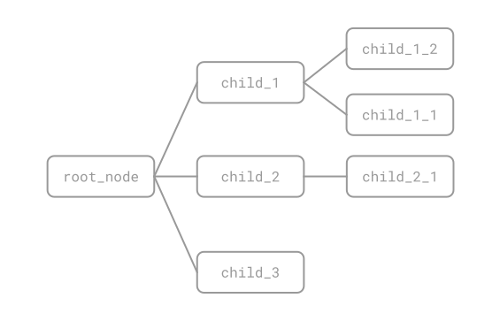

# Tree-in-Rows Elemental Format

TREF is a plain text file format that describes trees in a human readable way. There are other formats to describe trees, which the most widely used is [Newick](https://en.wikipedia.org/wiki/Newick_format). The problem with Newick is that it is hard to write, but it is even harder to read. There are other formats like [PhyloXML](https://en.wikipedia.org/wiki/PhyloXML) and [Nexus](https://en.wikipedia.org/wiki/Nexus_file), but are verbose, complex and very specialized on bioinformatics.

With TREF a human can write a tree and understand the structure by having a quick look, because it is designed to be both easy to handle for humans and easy to parse for machines.

Writing a tree in a file can be useful for many reasons: as a config file for an application, to store information that can be modified and read by an app and its user, to serialize tree-like memory structures, etc.

## What is a tree?

We started talking about trees without defining them. A tree is a specific kind of [Graph](https://en.wikipedia.org/wiki/Graph_(discrete_mathematics)) that doesn't contain cycles. That means, there are no closed loops.

A tree starts with a root node and from it can sprout any number of child nodes (from zero to infinite), that in turn can have any other number of child nodes, and so on. A node can only have one parent (or zero, if it is the root), otherwise it would have cycles, and wouldn't be a tree. Only the root node can have no parent, if there are more nodes with no parent it means we have more than one tree.

## The TREF file

Let's start by an example. We will represent a tree like the following:



Filename: `example_1.tref`

```
# A simple tree.

[my_tree_name]

+ root_node
+ + child_1
+ + + child_1_1
+ + + child_1_2
+ + child_2
+ + + child_2_1
+ + child_3
```

This example has all the elements a TREF file can contain: comments (lines starting by `#`), tree names (lines starting by `[` and ending by `]`), and tree nodes (lines starting by any number of `+` divided by a simple space).

Node hierarchy is represented using pairs of `+` and `space`. Each pair represents a node level. In the example, `root_node` is of level 1, `child_1` is of level 2, `child_1_2` of level 3, etc.

A node (`A`) is considered to be descendant of another (`B`) if `A` is located below `B` (immediately or not), `A` has a higher level than `B`, and no other nodes of the same level of `B` are in between.

A valid TREF file meets the following rules:

1. Each line ended by a newline represents a statement.
2. Empty statements are allowed (with spaces, tabs and newlines).
3. A comment statement must start with `#`, no spaces or tabs are allowed before it. After it any character is allowed.
4. Tree names must be enclosed between brackets (`[]`) and no spaces or tabs are allowed. The tree name can only have letters (`A-Z`, `a-z`), numbers (`0-9`) and underlines (`_`).
5. Tree nodes must start by, at least, one `+` followed by a space. After the last space it comes the node name, that can contain any character (even spaces or tabs), with the only limitation that the first character can't be a `+`.
6. There must be one tree name per tree, and it must come before the root node.
7. A file can contain multiple trees, each one properly labeled with a tree name.
8. Empty trees are permitted and are represented by a tree name with no nodes after it.
9. Node levels must be consecutive, a node of level N can only contain nodes of level N+1.
10. Any line that is not empty, a comment, a tree name or a node, is considered invalid.

We have seen a correct example, let's see some wrong ones and why they are **incorrect**.

Filename: `example_2.tref`

```
# WARNING: this file is invalid
   # this comment is incorrect
```

It's incorrect because it contains an invalid comment statement at line 2, it doesn't start by a `#`.

Filename: `example_3.tref`

```
# WARNING: this file is invalid
[ my_tree]

 [my_tree_2]
```

It has two tree names, but both are invalid, because the fist one contains forbidden characters (a space inside the brackets), and the second doesn't start by a `[` (it starts by a space).

Filename: `example_4.tref`

```
# WARNING: this file is invalid
[my_tree]
+ root_node
+ + child_1
+ + +child_2
 + + child_3
```

This one is invalid because it has a node name that starts by `+` (line 5) and a node statement that doesn't start by a `+` (line 6).

Filename: `example_5.tref`

```
# WARNING: this file is invalid
[my_tree]
+ root_node
+ + child_1
+ + + + child_1_1
```

The `child_1` contains a node (`child_1_1`) of a non consecutive level (is should be level 3 but is level 4).

## Dialects

The node name format in TREF is intentionally permissive. After the initial plus signs, it basically accepts anything, any character, spaces, brackets... whatever. And the reason is **user defined dialects**.

Imagine we have an application in which the weight of each vertex (node connection) is important. TREF doesn't provide a way to assign values to vertex, but the user can define a specific format in the node that can. It could be something like:

Filename: `example_6.tref`

```
[my_tree_dialect]

+ root_node
+ + 27:child_1
+ + + 99:child_1_1
+ + + 56:child_1_2
+ + 5:child_2
```

When parsed, the user will receive a node where the identifier is a string like `99:child_1_1`, that will be able to parse and generate a custom object to fill the tree structure.
